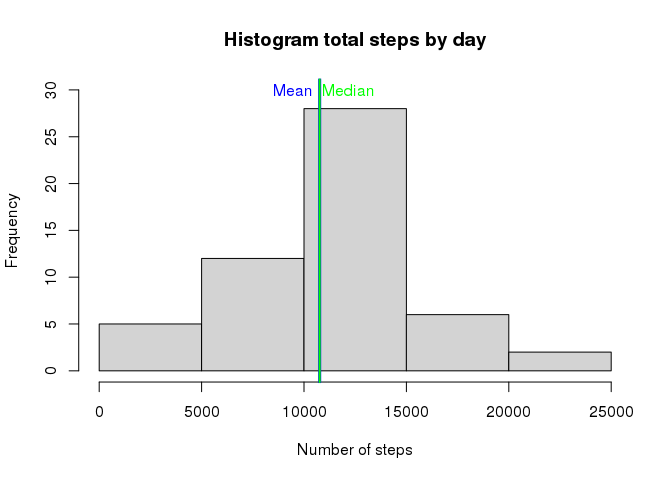
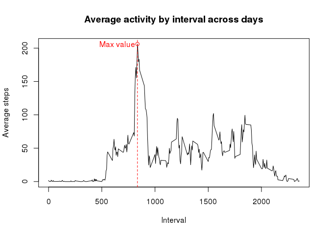
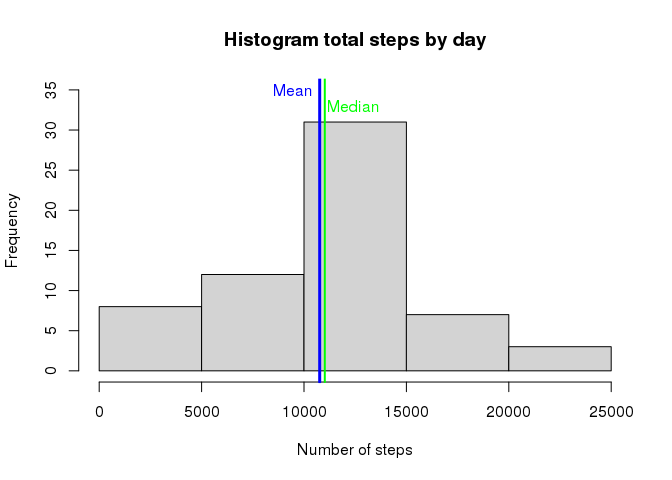
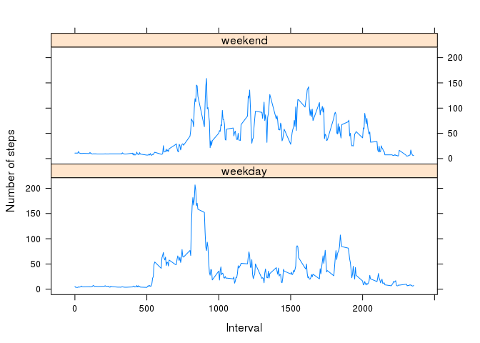

# Reproducible Research: Peer Assessment 1


## Step 1: Loading and preprocessing the data
This code will search for the activity.csv file. If it is not present in the current directory, it searches for the activity.zip file. If the zip file is present, it is unzipped. If not, the zip file is downloaded from the URL provided in the task description and then it is extracted.


```r
url<- "https://d396qusza40orc.cloudfront.net/repdata%2Fdata%2Factivity.zip"
fileName <- "activity.csv"
zipFile <- "activity.zip"
# Download and/or extract file if it does not exist
if (!file.exists(fileName)) {
    if (!file.exists(zipFile)) { download.file(url,destfile=zipFile) }
    unzip(zipFile)
}
activityData <- read.csv(fileName, colClasses = c("integer","character","integer"))
# Cast date column to Date type
activityData$date <- as.Date(activityData$date, "%Y-%m-%d")
```


## Step 2: What is mean total number of steps taken per day?

**1. Aggregate the data by date, and then build a histogram showing the number of days where the total step activity lies within each interval.**


```r
dailySteps <- aggregate(steps ~ date, data=activityData, FUN=sum, na.action=na.omit)
# Avoid computing the mean several times
# Formatted values are shown after the plot
meanTotalSteps <- mean(dailySteps$steps)
formattedMeanTotal <- format(meanTotalSteps)
medianTotalSteps <- median(dailySteps$steps)
formattedMedianTotal <- format(medianTotalSteps)


# Histogram
hist(dailySteps$steps, xlab="Number of steps", ylab="Frequency", main="Histogram total steps by day",
     freq=TRUE, col="lightgray", ylim=c(0,30))
abline(v=meanTotalSteps, col="blue", lwd=3)
abline(v=medianTotalSteps, col="green", lwd=2)
text(x=meanTotalSteps-1300, y=30, labels=c("Mean"), col="blue")
text(x=medianTotalSteps+1400, y=30, labels=c("Median"), col="green")
```

 

**2. Mean and median total daily steps**

- The daily mean total number of steps is **10766.19**.
- The daily median total number of steps is **10765**.


## Step 3: What is the average daily activity pattern?

**1. Aggregate data by interval across days. Then build the time plot.**

```r
# Aggregaate data and avoid recalculating the interval with maximum activity.
intervalSteps <- aggregate(steps ~ interval, data=activityData, FUN=mean, na.action=na.omit)
intervalMax <- intervalSteps[which.max(intervalSteps$steps),"interval"]
maxSteps <- intervalSteps[which.max(intervalSteps$steps), "steps"]
# Time series
plot(intervalSteps, type="l", xlab="Interval", ylab="Average steps", main="Average activity by interval across days")
abline(v=intervalSteps[which.max(intervalSteps$steps),"interval"], col="red", lty=2)
points(x=intervalMax, y=maxSteps, col="red", type="o")
text(x=intervalMax-190, y=maxSteps, col="red", labels=c("Max value"))
```

 


**2. Interval holding the maximum number of steps**

```r
intervalMax <- intervalSteps[which.max(intervalSteps$steps),"interval"]
maxSteps <- intervalSteps[which.max(intervalSteps$steps), "steps"]
formatIntervalMax <- format(intervalMax)
formatMaxValue <- format(maxSteps)
```

The interval with the maximum average is **835** and the maximum average is **206.1698**.

## Step 4: Imputing missing values

**1. Calculate the number of rows with missing information**

```r
rowsNA <- sum(is.na(activityData))
with(subset(activityData,is.na(steps)), {table(date)})
```

```
## date
## 2012-10-01 2012-10-08 2012-11-01 2012-11-04 2012-11-09 2012-11-10 
##        288        288        288        288        288        288 
## 2012-11-14 2012-11-30 
##        288        288
```

The number of rows with missing information is **2304**.


**2. Fill missing information with the average of the same interval for the days with information.**

```r
# Included here for the sake of clarity. Calculated as in Step 3.
intervalSteps <- aggregate(steps ~ interval, data=activityData, FUN=mean, na.action=na.omit)
naIndex <- which(is.na(activityData$steps))
correctedData <- activityData
# Get only rows with missing info, merge them with the averages, replace only the NA rows.
missingIntervals <- correctedData[naIndex,]
missingValues <- merge(missingIntervals, intervalSteps, by="interval")
correctedData[naIndex, "steps"] <- missingValues[,"steps.y"]
```


**3. Build a histogram with the corrected data for the total number of steps taken each day**

```r
dailyCorrSteps <- aggregate(steps ~ date, data=correctedData, FUN=sum, na.action=na.omit)
hist(dailyCorrSteps$steps, xlab="Number of steps", ylab="Frequency",
     main="Histogram total steps by day", freq=TRUE, col="lightgray", ylim=c(0,35))
abline(v=mean(dailyCorrSteps$steps), col="blue", lwd=3)
abline(v=median(dailyCorrSteps$steps), col="green", lwd=2)
text(x=mean(dailyCorrSteps$steps)-1300, y=35, labels=c("Mean"), col="blue")
text(x=median(dailyCorrSteps$steps)+1400, y=33, labels=c("Median"), col="green")
```

 


**4. Report median and mean**

```r
formatCorrMean <- format(mean(dailyCorrSteps$steps))
formatCorrMedian <- format(median(dailyCorrSteps$steps))
# Mean and median without replacing the NAs
formatMean <- format(mean(dailySteps$steps))
formatMedian <- format(median(dailySteps$steps))
```

- Mean replacing missing values: **10766.19**
- Mean ignoring missing values: **10766.19**
- Median replacing missing values: **11015**
- Median ignoring missing values: **10765**

Ignoring the NA values or replacing them with the aforementioned strategy makes no difference for the mean value. However, the values for the median are different, the value when using the replacement of NAs is higher than the original.

## Step 5: Are there differences in activity patterns between weekdays and weekends?
First, we add a column to the corrected data with the weekday (Monday, Tuesday...) that corresponds to the date. Then this weekday is transformed into the values "weekend" or "weekday" depending on whether the day is Saturday/Sunday or not. 


```r
# Force the Locale to use english day names
Sys.setlocale("LC_TIME", "en_GB.UTF-8") 
```

```
## [1] "en_GB.UTF-8"
```

```r
# Add the new column to the data frame
correctedData <- transform(correctedData, weekday=factor(weekdays(date)))
# Change the name of the day to the desired labels
levels(correctedData$weekday)[levels(correctedData$weekday)!="Saturday" 
                              & levels(correctedData$weekday)!="Sunday"]<-"weekday"
levels(correctedData$weekday)[levels(correctedData$weekday)=="Saturday" 
                              | levels(correctedData$weekday)=="Sunday"]<-"weekend"
```

With the new column, we build the desired plot to see if the activity changes between weekdays and weekends.


```r
library(lattice)
intervalDayData <- aggregate(steps ~ interval + weekday, data = correctedData, mean)
xyplot(steps ~ interval | weekday, data=intervalDayData, type = "l", layout = c(1, 2), 
       xlab = "Interval", ylab = "Number of steps")
```

 

Comparison for some statistics grouping by weekday and weekend.

```r
tapply(intervalDayData$steps, intervalDayData$weekday, summary)
```

```
## $weekday
##    Min. 1st Qu.  Median    Mean 3rd Qu.    Max. 
##   3.504   7.399  23.860  34.890  48.780 206.800 
## 
## $weekend
##    Min. 1st Qu.  Median    Mean 3rd Qu.    Max. 
##   5.051   9.763  35.200  44.400  73.070 158.800
```

The statistics and the plot seem to suggest that during the weekends the activity is more distributed through the day, whereas during weekdays the activity is more concentrated in the first hours of activity. 
